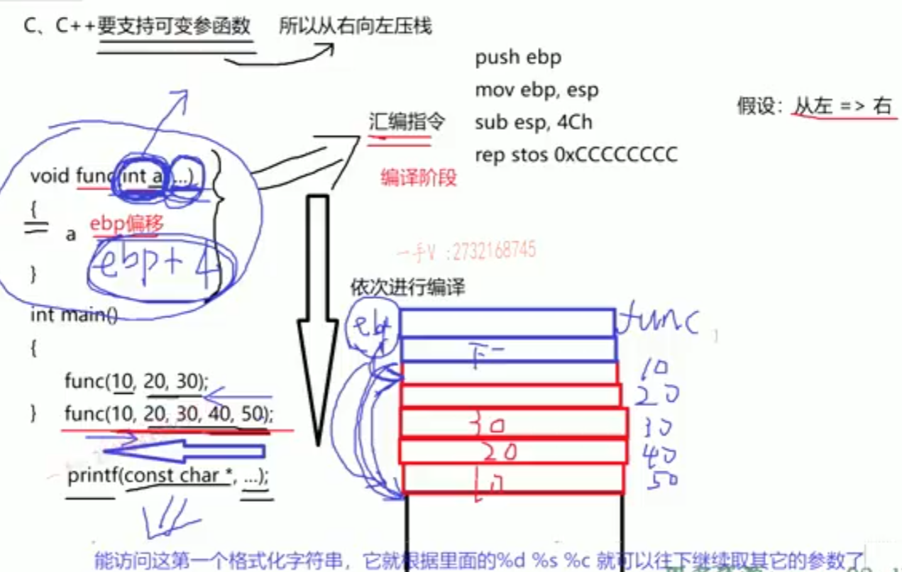
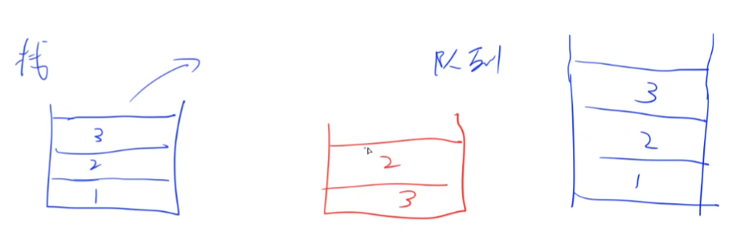
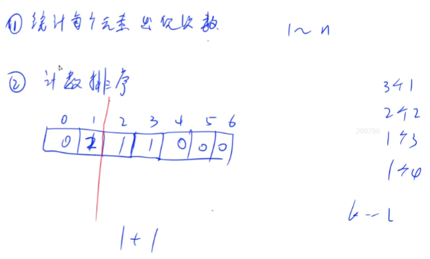

# C++

## 基础部分

### :rocket: **C和C++有什么异同？**

- C++(C with classes)引入了类、引用的概念，而C中均没有
- C++引入 new/delete 运算符，取代了C中的 malloc/free 库函数
- C++中允许在程序的任意位置声明变量，而C只允许在程序的开头声明变量
- C++扩展了运算符重载的概念，允许为用户定义的类型重新定义运算符的含义
- C是面向过程编程的语言，而**C++是集基于对象编程、面向对象编程、泛型编程、函数式编程和面向过程编程的语言**
- C++中自定义函数时形参列表为空与在括号中使用 void 等效，都表示不接收参数；而在C中括号为空意味着对是否接受参数保持沉默，即可以接收、也可以不接收
- C++对于变量名称的长度无限制，名称中所有的字符都有意义；而ANSI C(C99标准)只保证变量名称中前63个字符有意义，即前63个字符相同的名称被认为是相同的
- C++中认为`int a = 1; int a(1); int a = {1}; int a {1};`四种形式对变量的声明都是合法的，而C只认为`int a = 1;`赋值方式是合法的(其他数组等容器的初始化方式相同)
- C语言允许将 void * 的指针隐式转换为任意类型的指针，C++不允许
**综上所述，C++是C的超集，C是C++的子集。**

### :rocket: **getline() 和 get() 有什么异同？**

- 两者都**可以**是 istream 类中的成员函数/类方法，即都是面向行的读取输入函数，都可以通过句点表示法调用，如`cin.getline(*, *);`、`cin.get(*, *);`(但 getline() 也有不是类方法的调用情况，见函数重载)
-  cin.getline(Name, Size) 与 cin.get(Name, Size) 功能相同：第一个参数 Name 是用来存储输入行的数组的名称，第二个参数 Size 是要读取的字符数；两种用法都返回一个 cin 对象，因此有正确用法：`cin.get(Name, Size).get();`与`cin.getline(Name1, Size1).getline(Name2, Size2);` 
- **使用时两者都通过回车键输入的换行符来确定输入结尾**，但 getline() 将丢弃换行符，存储字符串时用空字符来代替换行符；而 get() 并不丢弃，且将其保留在输入队列中，因此需要用如下代码片段来跨过换行符，连续进行多个输入时要特别注意

```C++
while(cin.get() != "\n")
    continue;
```   

- 两者都有函数重载，具体见C++ Primer Plus Chapter 8：因此 get() 存在有不带任何参数的 cin.get() ，该函数可读取单个字符(即便是换行符)，这种用法常在`cin.get(Name, Size);`后面使用，即`cin.get(Name, Size).get();` 
-  getline() 用于读取面向整行的输入，用法`getline(cin, str);` 将 cin 作为参数，指出到哪里去查找输入，另外也没有指出字符串长度的参数，因为 string对象 将根据字符串的长度自动调整自己的大小，即此时的 getline() 是 <string> 的库函数
参考链接：[C++字符&字符串(字符数组)的输入输出](https://blog.csdn.net/Buster001/article/details/100083803)

### :rocket: **string对象 和 字符数组 有什么异同？**

- 使用 string 对象的方式与使用字符数组相同：可以使用C风格字符串(字符串字面值)来初始化 string 对象，可以使用 cin 将键盘输入存储到 string 对象中，可以使用 cout 显示 string 对象，可以使用数组表示法/下标索引来访问存储在 string 对象中的字符
- 可以将 string 对象声明为简单变量，而不是数组；要使用 string 类，必须在程序中包含头文件 <string> ，并且编译命名空间 using namespace std;  
-  string 对象可以互相整体赋值，而字符数组不可以，因为数组名的本质是个常量指针
- 类设计能够让程序自动处理 string 对象的大小，这使得与字符数组相比 string 对象更方便更安全
-  string 类中有类方法 size() ，可以获取 string 对象中包含的字符数，而字符数组只能使用 strlen 函数
- 未被初始化的 string 对象的长度被自动设置为0；而未被初始化的字符数组中第一个空字符的出现位置是随机的，这就给函数 strlen() 的运行结果带来了不确定性
- C++提供了三种表示C-风格字符串的方法：字符数组、字符串字面值和字符串指针，它们的类型都是 char * 

```C++
#include <string>
#include <iostream>

using namespace std;

int main()
{
    string str1;
    string str2 = "panther";

    cout << "Enter a kind of feline: "; //输入fox
    cin >> str1;

    cout << str1 << endl; //输出fox，类似于普通变量的输出方式
    cout << str2[0] << endl; //输出p，采用数组下标索引的方式进行访问

    return 0;
}
```

> :rocket: **sizeof 和 strlen 有什么异同？**

-  sizeof 是一个运算符(类似于加减乘除)，而 strlen 是 cstring 头文件中的库函数
-  sizeof 的参数可以是数据的类型，也可以是变量；而 strlen 只能是以结尾为 ‘\0’ 的字符串(**字符串变量、字符数组**)作参数
- 编译器在编译时就计算出了 sizeof 的结果，而 strlen 函数必须在运行时才能计算出来
-  sizeof 返回的是数据类型占内存的大小；而 strlen 返回的是存储在数组中的字符串的长度，而不是数组本身的长度，另外只包含可见字符，即不包含空字符。因此如果存储 cosmic 字符串，数组的长度不能短于 strlen(cosmic) + 1 
- 数组做 sizeof 的参数不退化，而传递给 strlen 时就退化为指针了

```C++
#include <iostream>
#include <string>

using namespace std;

int main()
{
    int a = 4;
    //操作符sizeof()的参数可以是变量的类型，也可以是变量名
    cout << sizeof(int) << ' ' << sizeof(a) << endl; //输出均为4

    char p[10] = "wuyan";
    cout << sizeof(p) << ' ' << strlen(p) << endl; //前者输出10，后者输出5
    //说明操作符sizeof()返回的是变量所占内存的大小，而函数strlen()返回的是字符串的长度，还不包含空字符
    //在这种情况下，不会将数组名解释为第一个元素的地址，这是数组名与指向数组的指针的区别所在
    return 0;
}
//20230319_sizeof与strlen的区别.cpp
```

### :rocket: **数组名与指向数组的指针有什么异同？**

- 刚开始时它们都指向数组的第一个元素，因此 n[i] 、 pn[i] 、 *(n + i) 与 *(pn + i) 等效，均表示数组的第 i 个元素; &n[i] 、 &pn[i] 、 (n + i) 与 (pn + i) 等效，均表示数组的第 i 个元素的地址( pn 是指向数组 n 的指针)
- 注意 n 与 &n 之间的区别：前者指向数组中的第一个元素，而后者指向整个数组，因此 n + 1 指向数组中的下一个元素，而 &n + 1 指向后面一个12字节内存块(这里认为数组含有三个 int 类型元素，且 int 类型占四个字节)；另一个区别是为了得到数组中的第一个元素，只需对前者解除一次引用，但需要对后者解除两次引用

```C++
#include <iostream>

using namespace std;

int main()
{
    int n[3] = {1, 2, 3};
    int *pn = n;

    cout << n[1] << endl;
    cout << pn[1] << endl;
    cout << *(n + 1) << endl;
    cout << *(pn + 1) << endl;

    cout << &n[1] << endl;
    cout << &pn[1] << endl;
    cout << (n + 1) << endl;
    cout << (pn + 1) << endl;

    cout << n << endl;
    cout << n + 1 << endl;
    cout << &n << endl;
    cout << &n + 1 << endl;
    cout << pn << endl;
    cout << pn + 1 << endl;
    cout << &pn << endl;
    cout << &pn + 1 << endl;

    return 0;
}
//20221117_数组与指针2.cpp
```

- 更多程序见 20220930_数组与指针1.cpp 与 201120_数组与指针2.cpp
- 数组名虽然是数组第一个元素的地址，但它本质上还是个常量，不能修改其值；而指向数组的指针是个变量，因此可以进行指针意义下的加减操作进而更新指向
- 对数组名应用 sizeof 运算符得到的是整个数组的长度(以字节为单位)，而对指向数组的指针应用 sizeof 运算符得到的是指针所占内存空间的长度，即使此时指针指向的是一个数组。即在这种情况下，C++不会将数组名解释为地址
- 对数组名应用地址运算符时，得到的将是整个数组的地址(整个数组长度)，而不是数组中第一个元素的地址
- 对于字符数组要特别注意：在 cout 和多数C++表达式中， char数组名 、 char指针 以及 用引号括起的字符串常量 (存储在静态只读区)都被解释为字符串第一个字符的地址，它们传递给 cout 时，**将打印该地址处的字符，然后继续打印后面的字符，直到遇到空字符为止**。见下面的代码分析：
  
```C++
#include <iostream>

using namespace std;

int main()
{
    char flower[10] = "rose";
    int num[10] = {1, 2, 3};

    cout << flower << endl; //输出rose，因为flower是字符数组
    cout << num << endl; //输出0x62fdf0，因为num是整型数组名，本质上是个指针
    cout << num[0] << endl; //输出1，num[0]是数组中的第一个元素

    return 0;
}
``` 

- 更多内容见C++ Primer Plus 4.8.3小节

### :rocket: **在查看输入方面， cin >> ch 、 cin.get(ch) 、 ch = cin.get()有什么异同 ？**

| 属性| cin.get(ch) | ch = cin.get() |
| :---------: | :---------: |:---------: |
| 传递输入字符的方式 | 赋给参数ch | 将函数返回值赋给ch |
| 用于字符输入时函数的返回值 |  istream 对象(执行 bool 转换后为 true )，因此可以有用法 cin.get(ch1).get(ch2)  |  int 类型的字符编码，与C语言中函数getchar()相似 |
| 到达文件尾时函数的返回值 |  istream 对象(执行 bool 转换后为 false ) | 文件尾EOF |

-  cin >> ch 读取时，读入时使用空白(回车、制表符、换行符)来确定字符串的结束位置，会自动过滤这些空白，遇到后停止读入；**即不会读入这些空白，但并不会将它们从输入队列中删除，在连续进行多个输入时要注意(见C++ Primer Plus P81 程序清单4.6)**；并且之后当用户按下回车键之后，输入的内容才会被发送给程序，进入缓冲；读入完成后， cin 自动在字符串的结尾添加空字符
- 若 cin >> ch 输入内容的类型与存储内容的类型不匹配，将发生：变量 ch 的原内容保持不变、不匹配的输入仍然保留在输入队列中、 cin 对象中的一个错误标记被设置(即读入功能被禁用)、对 cin 方法的调用将返回 false (如果被转换为 bool 类型)(输入错误、输入类型不匹配、文件尾EOF都将导致 cin 返回 false )

```C++
#include  <iostream>

using namespace std;

int main()
{
    int num1, num2;
    cout << "First number" << endl;
    cin >> num1;

    cin.clear(); //当输入类型与存储类型不匹配cin读入功能被禁用时重置输入
    while(cin.get() != '\n'); //消耗类型不匹配的输入，以便进行接下来的输入

    cout << "Last number" << endl;
    cin >> num2;

    cout << "num1 = " << num1 << " , num2 = " << num2 << endl;

    return 0;
}
```

-  cin.get(ch) 在读取字符时，将读取输入中的**下一个字符(即使它是空格)**，并将其赋给变量 ch ，这在一定程度上弥补了用法 cin >> ch 的缺陷
- 到现在，已经接触过 get() 的四种不同用法： cin.get() 、 ch = cin.get() 、 cin.get(ch) 、 cin.get(Name, ArSize) 

> :rocket: **switch 与 if else 有什么异同？**

- 两者都允许程序从选项中进行选择，但相比之下 if else 更加通用
- 例如只有 if else 可以处理**取值范围**问题，而 switch 中的每一个 case 标签都必须对应一个整数(含 char )，因此 switch 无法处理浮点数测试。另外 switch 标签值还必须是常值，无法处理变量的比较或选择问题
- 当然如果所有的选项都可以使用整数常量来表示，且数量多于3个时，就代码长度和执行效率而言， switch 将更加高效

```C++
#include <iostream>
#include <string>
#include <cctype>

using namespace std;

//判断读入的字符是否为元音字母开头
int main()
{
    string words;
    int vowels = 0, consonants = 0, others = 0;

    while (cin >> words)
    {
        if (isalpha(words[0]))
        {
            switch(words[0]) //这里如果要用if结构则需要有十个条件表达式
            {
                case 'a':
                case 'e':
                case 'i':
                case 'o':
                case 'u':
                case 'A':
                case 'E':
                case 'I':
                case 'O':
                case 'U': 
                    vowels++;
                    break;
                default: 
                    consonants++;
            }
        }
        else
        {
            others++
        }
    }

    return 0;
}
``` 

### :rocket: **break 与 continue 有什么异同？**

-  break 既可用在循环中，又可用在 switch 中，而 continue 只可用在循环中
- 当 break 用在循环中时，表示立刻结束循环，转而执行循环体之外的语句；而 continue 用在循环中时，表示跳过循环体剩余部分(即不会跳过 for 循环的更新表达式)，转而执行下一次循环
- **当 break 用在 switch 中时，表示跳过 break 之后的所有 case** 

### :rocket: **关键字 const 与指针相结合的三种不同用法有何区别？**

- 用法 const int *pt; 表示 pt 指针可以指向任意 int 类型的变量，但不能通过该指针修改所指向对象的值( const int 限定)，但是这并不代表所指向对象必须是常量，即可以直接通过变量来修改其值，但不能通过 pt 指针修改
- 用法 int *const pt; 表示不能修改 pt 指针以指向其他对象，但是可以通过指针修改当前所指向对象的值
- 用法 const int *const pt; 表示既不能修改 pt 指针以指向其他对象，也不能通过该指针修改所指向对象的值
- 前两种用法的主要区别是关键字 const 与 * 的相对位置关系：若 const 在前表示 *pt 为只读， const 在后表示 pt 为只读
- 如果数据类型不是指针(数组名)(即数据类型与指针之间只有一层间接关系)，则可以将 const 数据或非 const 数据的地址赋给指向 const 的指针，但只能将非 const 数据的地址赋给非 const 指针。因此为了使函数应用范围更广，应将指针形参声明为指向 const 的指针

```C++
const int months[3] = {31, 28, 19};
int sum(int arr[], int n);
int j = sum(months, 3); //报错，编译器不允许将 const 指针赋给非 const 指针
```

- 更多内容见C++ Primer Plus 7.3.5 小节

### :rocket: **使用关键字 auto 进行自动类型推断时需要注意什么问题？**

- 使用 auto 定义的变量必须有初始值，因为它是让编译器通过初始值来判断变量的类型的
- 使用 auto 也能在一条语句中声明多个变量，因为一条声明语句只能有一个基本数据类型，所以该语句中所有变量的初始数据类型都必须一样
- 当引用被用作初始值时，真正参与初始化的是引用对象的值(与 decltype 相区别)，此时编译器以引用对象的类型作为 auto 变量的类型
- auto 一般会忽略掉顶层 const，但底层 const 会保留下来
- auto 只能用于单值类型推断，而不能使用初始化列表
- 当用初始化列表初始化数组时，仅当列表中含有单一的初始化器才可以使用 auto
- **auto 可以用于函数返回类型，即把函数真正的返回类型跟在形参列表之后，在本应该出现返回类型的地方放置 auto**

```C++

auto p1 = new auto(obj); //p1指向一个与obj类型相同的对象
auto p2 = new auto{a, b, c}; //错误，括号中只能有单个初始化器

// 声明返回一个指向具有10个整型元素数组的指针
auto func(int i) -> int(*)[10];
```

- 参考链接：https://zhuanlan.zhihu.com/p/343507680

### :rocket: **关键字 auto 与关键字 decltype 在类型推断时有何区别？**

### :rocket: **左值与右值有何区别？**

- 左值是**可以取地址**的数据对象(如变量、数组元素、结构成员、引用和解除引用的指针)，即常规变量和 const 变量都可视为左值，因为可以通过地址访问它们，但常规变量属于可修改的左值，而 const 变量属于不可修改的左值，左值一般存放在内存之中
- 右值分为纯右值和将亡值，纯右值包括字面常量(**用引号括起的字符串除外，它们由其地址表示**)和包含多项的表达式，将亡值包括匿名对象，右值一般存放在寄存器中
- 赋值语句的左边必须是可修改的左值，即左边的子表达式必须标识一个可修改的内存块，如返回类型为引用的函数。常规函数(返回类型为非引用)的返回值为右值，因为这种返回值位于临时内存单元中，运行到下一条语句时，它们可能不再存在
- **返回左值引用的函数，连同赋值、下标、解引用和前置递增/递减运算符，都是返回左值表达式的例子，而返回非引用类型的函数，连同算术、关系、位以及后置递增/递减运算符，都是返回右值表达式的例子(区分前置/后置运算符)**
- 左值引用绑定到左值上，右值引用绑定到右值上，而 const 左值引用既可以绑定到左值上，也可以绑定到右值上，其中要注意的一点是右值引用类型的变量本身是左值，因此不能将右值引用绑定到右值引用的变量上
- 程序实例详见 20230620_左值与右值.cpp 与 20230621_左值引用与右值引用.cpp

### :rocket: **C++中为什么要引入右值的概念，移动构造函数是如何实现的？**

- **首先最重要的原因是为了效率，在一些重新分配内存资源的类中，从旧内存中将元素移动到新内存中、而不是拷贝到新内存中可以提高程序效率；另外还有一个原因是 IO 类或 unique_ptr 类的对象不能拷贝，因此只能移动**
- 当传入的形参为右值时，若该类不存在移动构造函数，由于 const 类型的左值引用可以绑定到右值，则根据函数的重载也会调用拷贝构造函数；若该类存在移动构函数，则会调用移动构造函数，此时移动构造函数是该调用的最佳匹配。因此可以通过重载拷贝构造函数和移动构造函数来实现移动操作，**区别在于拷贝构造函数不会修改源对象，而移动构造函数可能会修改源对象，使得源对象处于可修改状态**
- 除了完成资源移动，移动构造函数还必须确保移后源对象处于一种可析构的状态，即移动后源对象的析构函数必须能够安全地销毁对象，特别是移后源对象不能再指向被移动的资源，这些资源的所有权已经归属与新创建的对象
- 移动构造函数在参数列表和成员初始化列表之间的关键字 noexcept 不可以被省略，这是在通知标准库移动构造函数不会抛出异常。因为当在对象移动的过程中有可能发生异常，此时旧空间中的移动源元素被改变了，而新空间中未构造的元素尚不存在，使用移动构造函数就会产生问题，问题在于它不能满足自身保持不变，而使用拷贝构造函数可以释放新分配但还未构造的内存空间并返回，源对象仍然存在，但这样会使效率降低，违背移动构造函数的本意。
- 如果希望在重新分配内存的过程中使用移动构造函数而不是拷贝构造函数，就必须显示地告诉标准库移动构造函数不会抛出异常可以安全使用，也就是用关键字 noexcept 来做到这一点。如果移动构造函数使用了关键字 noexcept，但在移动时抛出了异常，程序会调用函数 std::terminate() 来终止运行

### :rocket: **右值引用有什么作用？**

- 右值引用是C++11引入的特性，它是指对右值进行引用的一种方式。右值引用的作用主要有以下两个：
- 可以通过右值引用来实现移动语义。移动语义可以在不进行深拷贝的情况下，将对象的资源所有权从一个对象转移到另一个对象，从而提高代码的效率
- 右值引用还可以用于完美转发。在函数模板中，通过使用右值引用类型的形参来接收参数，可以实现完美转发，即保持原参数的值类别(左值还是右值)，将参数传递给另一个函数

### :rocket: **std::move() 是如何实现的？**

- 使用类型转换运算符 static_cast 来实现，static_cast 可以将左值转换为右值，但不能将右值转换为左值，因此 std::move() 可以将左值转换为右值，但不能将右值转换为左值
```C++
template <typename T>
typename remove_reference<T>::type&& move(T&& t)
{
	return static_cast<typename remove_reference<T>::type&&>(t);
}
```

### :rocket: **万能引用是如何实现的？**

### :rocket: **完美转发是如何实现的？**

### :rocket: **为什么在引用参数作形参时应可能使用 const ？**

- 使用 const 可以避免无意中修改数据的编程错误，若在函数中无意修改，则程序会发出警告或报错
- 使用 const 引用使函数能够处理 const 和非 const 实参，否则将只能接受非 const 数据，这是因为引用必须是变量的引用
- 使用 const 引用使函数能够正确生成并使用临时变量，如果实参与形参类型不匹配，则其行为类似于按值传递，为确保原始数据不被修改，将使用临时变量来存储值

```C++
#include <iostream>
#include <string>

using namespace std;

string version1(const string &s1, const string &s2);

int main()
{
    string input;
    string result;

    cout << "Enter a string: ";
    getline(cin, input);

    result = version1(input, "***");

    return 0;
}

string version1(const string &s1, const string &s2)
{
    string temp;

    temp = s2 + s1 + s2;
    return temp;
}
```

- 为了不修改字符串 input 中的值，函数的第一个形参使用 const 引用，调用函数时的第一个实参是 string 类型，因此让 s1 指向它没有任何问题
- 对于函数中的第二个形参， string 类定义了一种 char * 到 string 的转换功能，这使得可以使用C-风格字符串来初始化 string 对象(因为用引号括起的字符串常量值的本质是指向字符的指针，即 char * 类型)；但 string 类型为常量，正因为使用了 const 引用，函数将在实参与形参类型不匹配时创建一个正确类型的临时变量，使用转换后的实参值来初始化临时变量，然后传递一个指向该临时变量的引用
- 该函数中的 temp 变量只在函数内部有效，函数执行完毕之后它将不再存在，因此返回指向 temp 的引用不可行。在按值传递的过程中， temp 的内容将被复制到一个临时的存储单元中，然后在 main() 函数中，该存储单元的内容被复制到一个名为 result 的 string 中
- **综上所述，如果形参的类型为 const string & ，在调用函数时使用的实参可以是 string 对象或C-风格字符串，包括用引号括起的字符串常量、以空字符结尾的 char 数组或指向 char 的指针变量**
- **另外一个应用 const 类型的引用的地方是在拷贝构造函数之中，如果传入右值且该类没有移动构造函数，那么 const 类型的引用也能够绑定到左值，进而调用拷贝构造函数**

### :rocket: **关键字 const 与 static 之间有什么异同？**

- const 与 static 都是C++的关键字，都可以用来修饰函数或变量
- const 表示只读语义，表示运行时不可修改，const修饰的变量有三种：const 对象、const 指针、const 引用，根据它修饰的具体对象来决定不可变的对象是什么以及具体的操作有哪些。因为 const 对象一旦创建之后就不能再改变，所以必须初始化，而不能只定义
- static 表示静态存储，**被 static 修饰的变量会修改它的声明域和存储方式**，但不改变作用域，局部变量还是作用于局部，全局变量依然作用于全局，但均被默认初始化为0，它们从声明开始，就一直存在到程序运行结束，因为它们处于静态存储区
- const 修饰的变量能且只能在定义的同时进行初始化，程序运行时不能改变其值，当 const 修饰函数的形参时，既可以接收 const 类型的实参，又可以接收非 const 类型的实参；而 static 变量可以在程序运行期间多次赋值或改变其值
- 因为C++是类特性鲜明的语言，所以 const 和 static 又有另外意义。被 const 修饰的成员函数表明它不会修改调用对象的内容(mutable 修饰的变量除外)，一般被修饰的函数都是只读取信息的函数，**且可以访问类的所有成员**，包括静态成员和非静态成员，const 对象不可以调用非 const 成员函数；而被 static 修饰的成员函数不再为某一个类对象所拥有，而是被类特有，且这种函数只可访问静态成员，**不可访问非静态成员(包括成员函数和成员变量)**，不能被声明为 const、虚函数和 volatile
- **被 static 修饰的成员变量不能在类声明中初始化，必须在类定义的外部初始化，初始化时不需要使用关键字 static，且可以被任意非 static 成员函数访问；被 const 修饰的成员变量不能在类定义外部初始化，只能通过构造函数初始化列表进行初始化**

### :rocket: **关键字 const 的考点汇总**

- 默认情况下，const 对象被设定为仅在文件内有效，当多个文件中出现了同名的const 对象时，其实等同于在不同文件中都分别定义了独立的变量。**当希望在一个文件中定义多个文件中使用 const 对象时，需要在定义 const 对象时加上 extern 关键字，以使得const对象在多个文件中都有效**
- 引用只能绑定在对象上，但不能与某个字面值或表达式的计算结果绑定在一起。但在**初始化常量引用时允许使用任意表达式作为初始值，只要该表达式可以转换为引用的类型即可，尤其是允许为一个常量引用绑定非常量的对象、字面值甚至是个一般表达式**
```C++
int &refVal = 10; // 错误，引用必须绑定在对象上
double dVal = 3.14;
int &refVal2 = dVal; // 错误，引用类型必须与其绑定的对象严格匹配

int i = 42;
const int &r1 = i; // 正确，允许将一个引用常量绑定到非常量对象上
const int &r2 = 42; // 正确，允许将一个常量引用绑定到字面值上
const int &r3 = r1 * 2; // 正确，允许将一个常量引用绑定到一个表达式上
int &r4 = r1 * 2; // 错误，r4是普通的非常量引用
```
- 常量指针可以指向非常量对象，常量引用可以绑定非常量对象，含义是都不能通过指针或引用修改所指向或绑定对象的值，但该对象自身不一定是个常量
- 顶层 const 可以表示任意的对象是个常量，这一点对任何数据类型都适用；而底层 const 则与指针、引用等复合数据类型有关。指针类型既可以是顶层 const ，也可以是底层 const ，或者两者都是，或者两者都不是；**而引用只能是底层 const ，不存在顶层 const 的引用，因为引用不是对象**
- 不能忽视底层 const 在执行对象的拷贝操作时的限制。当执行对象的拷贝操作时，拷入和拷出的对象必须具有相同的底层 const 资格，或者两个对象的数据类型必须能够进行转换。一般来说，非常量可以转换为常量，反之则不行

```C++
int i = 0;
int *const p1 = &i; //顶层const
const int ci = 42; //顶层const
const int *p2 = &ci; //底层const
const int *const p3 = p2; //既有顶层const，又有底层const
const int &r1 = ci; //引用只能是底层const

i = ci; //顶层const对赋值操作无影响
p2 = p3; //正确，p2与p3所指向的对象类型相同，顶层const无影响

int *p = p3; //错误，p3包含底层const的定义，而p没有
p2 = &i; //正确，int * 能转换成const int *
int &r2 = ci; //错误，非常量引用不能绑定到常量对象上
```

### :rocket: **Lambda 表达式是什么？与普通函数有何异同？**

- **Lambda表达式是可调用对象**，C++中共有四种可调用对象：函数、函数指针、重载了函数调用运算符 operator() 的类(也称为函数符)、Lambda表达式
- Lambda表达式是C++11新增的一种形式，表示一个可调用的代码单元，可以将其理解为一个**匿名的内联函数**，语法格式如下所示。其中 capture list(捕获列表)是lambda所在函数中定义的局部非 static 变量的列表，parameter list 是参数列表，return type 是返回类型，function body 是函数体。**具体实现时可以省略参数列表与返回类型，但必须包含捕获列表与函数体**
```C++
 [capture list](parameter list) -> return type { function body }
 auto f = [] {return 42;};
 //空捕获列表表示此lambda表达式不使用它所在函数中的任何非static局部变量
```
- 与普通函数的声明方式不同：Lambda表示在定义时不需要指定函数名
- 与普通函数的返回类型不同：Lambda表达式可以省略返回类型，也可以由编译器根据函数体中的代码推断返回类型；在默认情况下如果一个Lambda表达式包含一个 return 之外的任何语句，则编译器假定此Lambda返回类型为void；若要为Lambda表达式显式地声明返回类型，**必须使用尾置返回类型**，即 -> return type。而普通函数必须显式声明返回类型，既不能省略也不能使用 auto 自动类型推断
- 与普通函数的作用域不同：Lambda表达式的**捕获列表只能用于局部非 static 变量**，因为它可直接访问局部 static 变量和在它所在函数之外声明的变量；而普通函数需要通过参数传递或全局变量来访问其他作用域中的变量
- 与普通函数的形参列表不同：Lambda表达式的**形参列表中不能有默认参数**，一个Lambda调用的实参数目永远与形参数目相等；而普通函数中可以有一个或多个默认参数，且默认参数必须放在形参列表的右侧位置
- 与普通函数的编译器实现不同：Lambda表达式的类型是在编译期间生成的，而普通函数的类型是在链接期间生成的。**因此，Lambda表达式的类型可直接嵌入其他类型中，如容器和算法；而普通函数则需要使用函数指针或函数对象**
- Lambda表达式的使用更加灵活、简洁，在函数对象、回调函数、泛型编程等场景中具有广泛的应用。但是，在使用Lambda表达式时，应注意避免过多的捕获和复杂的语句块，以保证代码的可读性和维护性

### :rocket: **叙述内联函数如何实现及注意要点？**

- 在大多数机器上，一次函数调用可能包含着一系列工作：调用前要先保存寄存器，并在返回时恢复；有可能需要拷贝实参；程序转向一个新的位置执行。为了消除这些开销，在函数的返回类型之前使用关键字 inline，可以要求编译器在每个调用点上“内联”展开函数代码。内联函数一般在声明处展开函数体
- **内联函数的执行速度比常规函数稍快，但代价是需要占用更多的内存空间**。因此内联函数只适用于规模较小、频繁调用、流程简明直接的函数
- 一般情况下所有函数都可以设为内联函数，但内联函数只是向编译器发出的一个请求，编译器可以选择忽略此请求，可能是编译器觉得此函数规模过大或此函数发生了递归调用(内联函数不能递归)
- 综上，应该有选择的使用内联函数，如果函数调用机制的开销比函数本身执行的开销要大，而且函数频繁发生调用的话，可以考虑使用内联函数。**但是，内联函数的定义必须放在头文件中，否则编译器无法在调用点展开函数体，导致链接错误**

### :rocket: **叙述函数指针的定义及用途？**

- 与普通内置类型指针一样，函数指针中存放的是函数的地址，也就是函数机器语言代码的内存的开始地址
- 声明函数指针需要指明其所指向的函数类型，**函数类型由函数的返回类型与形参列表共同确定，而与函数名无关**

```C++
// 优先级：圆括号 > 方括号 > 取内容运算符
double *pf(int); //声明一个函数，其返回类型为double*，形参列表为int
double (*pf)(int); //声明一个函数指针，其所指向的函数返回类型为double，形参列表为int
```

- C++中允许像使用函数名一样直接使用函数指针，如下所示，这种用法与数组名与数组首元素的关系类似
```C++
double pam(int);
double (*pf)(int);
pf = pam; //pf指向pam函数
double x = pam(4);
double y = pf(5); //合法使用
double z = (*pf)(5); //合法使用
```

- 要深刻理解函数指针，最关键的还是要牢记运算符优先级：圆括号 > 方括号 > 取内容运算符，程序实例详见20221126_运算符优先级1.cpp、20221215_运算符优先级2.cpp

### :rocket: **叙述函数重载相关内容？**

- 在同一作用域内名字相同而形参列表不同的函数构成函数重载。这里要注意函数的类型包括返回值类型与形参列表，而形参列表中又包括形参类型和形参个数，所以**名字相同且只有返回类型不同的函数不构成函数重载**，main 函数不能重载
- 一个拥有顶层 const 的形参无法与另一个没有顶层 const 的形参区分开来，如下所示，而**如果形参是某种类型的引用或指针，则通过区分其指向的是常量对象还是非常量对象可以实现函数重载，此时的 const 是底层的**
```C++
Record lookup(Phone);
Record lookup(const Phone); //重复声明

Record lookup(Account&);
Record lookup(const Account&); //重载
```
- **类的成员函数有无 const 修饰也构成重载**，本质是指向调用该函数的 this 指针的底层 const 属性不同，即 this 指针所指向的该类的对象是否为 const 的
- 程序实例详见 20230608_成员函数中的函数重载.cpp

### :rocket: **关键字 inline 与 define 之间有什么异同？**


- 宏定义是在**预处理阶段**进行的，执行的是类似于**文本替换**的功能；而内联函数是在**编译阶段**进行的，本质上还是一个函数，**可以进行按值传递、类型检查与转换、代码生成等操作**
- 宏定义是内联函数早期在C语言中的版本实现，如果使用宏实现了类似函数的功能，要替换为内联函数

### :rocket: **如何理解 extern C ？**

### :rocket: **函数在调用时栈会发生什么变化？**

### :rocket: **C++11新特性有哪些？**

- auto 自动类型推断
- 范围 for 循环语句
- 更加丰富智能指针：shared_ptr、unique_ptr、weak_ptr，库函数make_shared、make_unique
- 新的STL容器：array、forward_list、unordered_map、unordered_set、unordered_multimap、unordered_multiset
- 右值引用与移动语义
- 列表初始化、新的类型

### :rocket: **#include <> 与 #include "" 有何异同？**

- 两者都是C++文件中用于包含头文件的方式。预处理器发现`#include`指令后，会就寻找指定的文件，然后将文件内容替换到`#include`指令所在的位置，就想你把被包含文件中的全部内容键入到源文件中的这个位置一样。但是两者搜索文件的路径不同
- `#include <>`用于包含标准库头文件，搜索标准库头文件的路径由编译器实现定义，一般来说，编译器会搜索某些标准目录，如`/usr/include`和`/usr/local/include`，但是具体的实现依赖于编译器，可以通过设置搜索路径环境变量或命令行选项来修改这些目录
- `#include ""`用于包含用户自定义头文件，一般来说，编译器会搜索当前文件目录或源文件所在的目录或文件名指定的其他目录，然后再搜索某些标准目录，如`/usr/include`和`/usr/local/include`

## 内存管理

### :rocket: **new/delete 和 malloc/free之间有什么异同？**

```C++
int *p = new int[2];
int *q = (int *)malloc(2 * sizeof(int));
```

- new 和 malloc 都可以用于内存的动态申请，delete 和 free 都可以用于内存的释放
- new/delete 是C++中的运算符，而 malloc/free 是C语言头文件 stdlib.h 中的库函数
- new/delete 操作时直接针对具体类型的指针，而函数 malloc 返回 void* 类型的指针，在赋给其他指针类型时需要进行类型转换
- new 将内存分配与对象构造组合在一起，因此会调用构造函数，而 malloc 不能；delete 将对象析构和内存释放组合在一起，因此会调用析构函数，而 free 不能
- delete 或 free 仅仅是告诉操作系统，这一块内存被释放了，即用户最好不要再使用。但是由于没有重新对这块内存进行写操作，所以内存中的内容**有可能**是垃圾值，**并且两者都不会销毁指针，指针不会指向空，进而出现野指针的情况。因此，释放完内存后应该将该指针置为空**
- 对于非内部数据类型的对象而言，光用 malloc/free 无法满足动态对象的要求。对象在创建的同时要自动执行构造函数，对象在消亡之前要自动执行析构函数。由于 malloc/free 是库函数而不是运算符，不在编译器控制权限之内，不能够把执行构造函数和析构函数的任务强加于 malloc/free。因此C++语言需要一个能完成动态内存分配和初始化工作的运算符 new，以及一个能完成清理与释放内存工作的运算符 delete
- 程序实例详见 20230318_free和delete怎样处理指针1.c、 20230318_free和delete怎样处理指针2.cpp、20230627_free和delete怎样处理指针3.cpp、20230628_free和delete怎样处理指针4.cpp

### :rocket: **new 和 malloc 有什么异同？**

- 分配内存的位置：**malloc 是从堆上动态分配内存，new 是从自由存储区为对象动态分配内存**。自由存储区的位置取决于 operator new 的实现。自由存储区不仅可以为堆，还可以是静态存储区，这都看 operator new 在哪里为对象分配内存
- 返回类型安全性：malloc 内存分配成功后返回 void*，然后再强制类型转换为需要的类型；而 new 操作符分配内存成功后返回与对象类型相匹配的指针类型，因此 new 是符合类型安全的操作符
- 内存分配失败返回值：malloc 内存分配失败后返回NULL，而 new 分配内存失败则会抛异常(bac_alloc)
- 分配内存的大小的计算：使用 new 操作符申请内存分配时无须指定内存块的大小，编译器会根据类型信息自行计算，而 malloc 则需要显式地指出所需内存的大小
- 是否可以被重载：operator new /operator delete 可以被重载，而 malloc/free 本身是库函数，不能重载

### :rocket: **如果 new 分配内存失败会怎样？**

- 一般情况下分配内存失败会抛出异常(bad_alloc)
- 但是如果使用了 std::nothrow 关键字，则分配内存失败会返回空指针(NULL)，而不会抛出异常
```C++
A *pa = new(std::nothrow) A;
```

### :rocket: **new 是在内存上哪一块去分配的内存？**

- new 所申请的内存区域在C++中称为自由存储区。很多编译器的 new/delete 都是以 malloc/free 为基础来实现的，所以通常都是借由堆实现来实现自由存储，这时候就可以说new所申请的内存区域在堆上

### :rocket: **如何只在栈上分配内存、创建对象？**

- 重载 new 运算符并设为私有权限

### :rocket: **指针与引用之间有什么异同？**

- **指针是对象，而引用不是对象**。因此可以定义指针的指针、指针的引用、存放指针的数组、指针常量，但不能定义引用的引用、引用的指针、存放引用的数组、引用常量

```C++
int i = 42;
int *p; // p是一个指向int型变量的指针
int *&r = p; // r是一个绑定指针p的引用
r = &i; // r引用了指针p，因此给r赋值&i就是令p指向i
*r = 0; // *r是i的别名，解引用得到i，因此给*r赋值0就是令i的值变为0

int **q; // q是一个指向指针的指针
q = &p; // q指向p

int *a[10]; // a是一个含有10个指针的数组
int (*b)[10] = &a; // b是一个指向含有10个整数的数组的指针

int *const s; // s是一个指向int型变量的常量指针(顶层const)
const int *t; // t是一个指向int型常量的指针(底层const)
```

- 可以把引用理解为类型的别名，因此引用必须被初始化，而指针不必，即存在空指针，但不存在不绑定任何对象的引用
- 除常量指针之外，指针在其生命周期之内可以更改所指向的对象，也允许拷贝和赋值，**但无法令引用重新绑定到另外一个对象**

```C++
int iVal1 = 10;
int iVal2 = 20;
int &refVal1 = iVal1;
int &refVal2; // 错误：引用必须绑定到对象
int &refVal3 = refVal1; // 正确：refVal3绑定到了那个与refVal1绑定的对象上，此处就是绑定到了iVal1上
refVal3 = 15; // 正确：refVal3是iVal1的别名，因此refVal3 = 15就是iVal1 = 15
&refVal3 = iVal2; // 错误：无法令引用重新绑定到另外一个对象
```

- 指针和引用都实现了对其他对象的间接访问，使用引用所绑定的对象时可以像使用变量一样使用引用，而使用指针所指向的内容时需解引用

### :rocket: **指针常量与常量指针有何区别？**

- 指针常量是指针本身是一个常量，具有顶层 const，即不能改变指针指向其他对象，但可以通过指针修改所指向对象的值
- 常量指针表示不可以通过指针修改所指向对象的值，具有底层 const，但可以更改指针以指向其他对象。**至于所指向的对象到底是不是常量，应该视该对象而决定，如果该对象不是常量，那么可以通过其他途径修改该对象的值，只不过不能通过常量指针修改而已**

### :rocket: **空指针、野指针、悬垂指针各是什么？**

- 一般将等于`0/NULL/nullptr`的指针称为空指针，空指针是不指向任何对象的指针，空指针不能被解引用，但是可以定义指向空指针的指针，即对空指针取地址
- 野指针是指向非法内存区域的指针，可能指向一个已经释放的内存地址，可能指向一个未分配的内存地址，也可能指向一个未初始化的内存地址，野指针是危险的，因为它指向的内存可能已经被其他程序使用，所以对野指针的解引用操作可能会导致程序崩溃
- 悬垂指针是指所指向的内容已被释放，指针指向的对象的声明周期已结束，但指针本身仍然存在，悬垂指针是危险的，因为它指向的内存可能已经被其他程序使用，所以对悬垂指针的解引用操作可能会导致程序崩溃

```C++
int *p = NULL; // 空指针
*p = 42; // 错误：不能解引用空指针
int **pp = &p; // 正确：可以定义指向空指针的指针

int *q; // 野指针，未被初始化的指针
*q = 42; // 错误：不能解引用野指针

int *r = new int(42);
delete r;
*r = 1024; // 悬垂指针，指针所指向的对象已被释放

int *s = nullptr;
{
    int i = 42;
    p = &i;
}
*p = 1024; // 悬垂指针，指向的对象的声明周期已结束
```

- 要解决以上问题，可以从以下几点入手：在解引用指针之前，要判断指针是否为空；对于定义的指针，一定要进行初始化；指针指向的对象的生命周期结束后，要将指针置为空；要注意长声明周期的指针不能指向短生命周期的对象；C++ 11 之后使用智能指针

### :rocket: **深拷贝与浅拷贝之间有什么异同？**

- 浅拷贝和深拷贝其实是**针对拷贝对象是否存在指针成员的情况**而言的
- 当存在指针成员而且浅拷贝发生，就会使得指针被拷贝一份但指针指向内容没有拷贝，也就是它们指向的内容是同一份，会存在内存释放时造成内存泄漏的风险，而两个对象被释放也会因为两次调用delete，而实际指向内容只有一份而程序崩溃
- 深拷贝就是基于这种情况，首先开辟属于自身的内存空间，然后把指针指向的内容拷贝到自身的内存空间中，一个类要实现深拷贝就要实现拷贝构造函数和赋值运算符重载函数
- 程序实例详见 20230103_深拷贝与浅拷贝 

### :rocket: **如何理解C++中的四种智能指针?**

- 首先说⼀下为什么要使用智能指针：智能指针的作用是**管理⼀个原内置指针所指向的堆上的动态内存空间**，避免程序员在函数结束时忘记释放申请的内存空间，进而造成内存泄漏情况的发生。使用智能指针可以很⼤程度上避免该问题，**因为智能指针就是⼀个类，当智能指针对象超出了对象的作用域时，类会自动调用析构函数，进而释放内存资源**
- 然后智能指针是对裸指针的RAII封装，在C++的历史上一共出现过四种智能指针，分别是auto_ptr、shared_ptr、unique_ptr、weak_ptr
- 早期的 auto_ptr 和之后的 unique_ptr 是为了实现对某一堆中对象的唯一管理，但**当移交管理的时候 auto_ptr 采取的是拷贝语义，unique_ptr 采用的是移动语义**，使得后者通用性更好；shared_ptr 采取引用计数思路管理对象生命周期，当多一个指向该对象的 shared_ptr，引用计数加一，相反减一，引用计数为 0 时，释放被指向的内存空间；weak_ptr 是为了解决 shared_ptr 强指向可能出现的循环引用导致的内存泄漏，和当被指向的对象被释放产生的悬垂指针问题。使用时需要注意尽量不要直接使用智能指针的裸指针
- 要使用智能指针，需要包含头文件 memory ，然后使用通常的模板语法来实例化所需类型的智能指针，例如：

```C++
auto_ptr<double> pd(new double);
//new double是new返回的指针，指向新分配的内存块，它作为模板类auto_ptr的构造函数的实参
```

- 智能指针模板类的常用接口有：
```C++
T* get();//用于得到C++内置指针，这个操作是比较危险的，因为脱离了智能指针的管理
//永远不要使用 get 初始化另一个智能指针或为智能指针赋值，否则很容易造成两个智能指针指向同一块内存
//当两个类的对象的析构函数释放同一块内存会造成程序崩溃
T& operator*();   
T* operator->();  
T& operator=(const T& val); 
T* release();  
void reset (T* ptr = NULL);
/*
T 是模板参数, 也就是传⼊的类型；

get()⽤来获取封装在智能指针内部的指针, 也就是获取原生指针；

operator()表示操作符重载 , operator->() 重载了->, operator=() 重载了=；

release()放弃对指针的控制权，返回指针，并将u置为空；
reset()直接释放封装的内部指针所指向的内存, 如果指定了 ptr 的值, 则将内部指针初始化为该值(否则将其设置为默认参数NULL)；
*/ 
```

-  auto_ptr (C++98的方案，C++11已抛弃)采用所有权(ownership)模式

```C++
auto_ptr<std::string> p1 (new string ("hello"));
auto_ptr<std::string> p2;
p2 = p1; //auto_ptr的互相赋值，采用拷贝语义，不报错
```

编译阶段不会报错！程序最终的结果是 p2 剥夺了 p1 对 string 对象的所有权，因为当执行  p2 = p1  的时候， p1 失去所有权、被置为 NULL ，这样可防止 p2 和 p1 的析构函数试图删除同一个对象。但是当其他程序运行时访问 p1 时会报错，因为它不再指向有效的数据，所以 auto_ptr 的缺点是：**存在潜在的内存崩溃问题(运行时)，不能指向数组，不能从函数中返回 auto_ptr，也不能作为 STL 容器的成员**

-  unique_ptr (替换 auto_ptr )

```C++
unique_ptr<string> pu1(new string ("hello world"));
unique_ptr<string> pu2；
pu2 = pu1; //报错，会留下悬挂的pu1，unique_ptr使用移动语义，不允许拷贝
unique_ptr<string> pu3;
pu3 = unique_ptr<string>(new string ("you")); //不报错
```

unique_ptr 实现独占式拥有或严格拥有概念，保证同⼀时间内只有⼀个智能指针可以指向该象。它对于避免资源泄漏特别有用，即 unique_ptr 比 auto_ptr 更安全。总之，程序试图将一个 unique_ptr 赋给另一个时，如果源 unique_ptr 是个临时右值(例如调用构造函数创建匿名对象)，编译器允许这样做；但如果源 unique_ptr 将存在一段时间，编译器禁止这样做。 **unique_ptr 无法进行拷贝构造和拷贝赋值，但是可以进行移动构造和移动赋值(类的实现中对拷贝构造函数和拷贝赋值运算符使用 `= delete`)**，也即可以从函数中返回 unique_ptr
- **智能指针模板类 auto_ptr 、 shared_ptr 使用 delete 而不是 delete [] ，因此只能与 new 一起使用，而不能与 new [] 一起使用，但 unique_ptr 拥有 new 搭配 delete 、 new[] 搭配 delete[] 的两个不同版本**

```C++
auto_ptr<int> pia(new int[20]); //报错，auto_ptr只能与new一起使用

int a = 6;
auto_ptr<int> pa(&a); //报错，只能指向使用new运算符开辟的内存空间(即堆内存)，而不能使用已存在变量的内存空间

string vacation("I wandered lonely as a cloud.");
shared_ptr<string> pv(&vacation); //报错，当pv过期时，delete运算符将用于非堆内存，这是错误的
```

-  shared_ptr (共享型，强引用)： shared_ptr 是为了解决 auto_ptr 在对象所有权上的局限性( auto_ptr 是独占的)，在**使用引用计数的机制上提供了可以共享所有权**的智能指针，即多个智能指针可以指向相同对象，该对象和其相关资源会在 “最后一个引用被销毁” 时候释放。可以通过成员函数 use_count() 来查看资源的所有者个数，除了可以通过 new 来构造，还可以通过传⼊ auto_ptr 、 unique_ptr 、 weak_ptr 来构造。当调用 release() 时，当前指针会释放资源所有权，引用计数减 1；仅当引用计数等于 0 时，才调用 delete ，释放内存资源
-  weak_ptr (弱引用)：如果说两个 shared_ptr 相互引用，那么这两个指针的引用计数永远不可能下降为0，也就是内存资源永远不会被释放。为解决上述问题引入了 weak_ptr ，它是一种不控制对象生命周期的智能指针，用来解决 shared_ptr 相互引用时的死锁问题。 weak_ptr 指向一个 shared_ptr 管理的对象，但进行该对象内存管理的却只是强引用的  shared_ptr， weak_ptr 只是提供了对管理对象的**一个访问手段**。 weak_ptr 设计的目的是为配合 shared_ptr 而引⼊的一种智能指针来协助 shared_ptr ⼯作，它只可以从一个 shared_ptr 或另一个 weak_ptr 对象构造。**它是对对象的一种弱引用，其构造函数和析构函数不会引起引用记数的增加或减少。它和 shared_ptr 之间可以相互转化， shared_ptr 可以直接赋值给它，它可以通过调用 lock() 函数来获得 shared_ptr** 。当两个智能指针都是 shared_ptr 类型的时候，析构时两个资源引用计数会减一，但是两者引用计数还是为1，导致跳出函数时资源没有被释放（析构函数没有被调用），解决办法：把其中一个改为 weak_ptr 就可以(解决 shared_ptr 循环相互引用的问题)

```C++
#include <iostream>
#include <memory>

using namespace std;

class B; //前置声明
class A
{
    public:
        shared_ptr<B> pb_;
        ~A()
        {
            cout << "A delete" << endl;
        }
};
class B
{
    public:
        shared_ptr<A> pa_;
        ~B()
        {
            cout << "B delete" << endl;
        }
};
void fun()
{
    shared_ptr<B> pb(new B());
    shared_ptr<A> pa(new A());
    pb->pa_ = pa;
    pa->pb_ = pb;
    cout << pb.use_count() << endl;
    cout << pa.use_count() << endl;
}
int main()
{
    fun();
    return 0;
}
```

- 在初始化智能指针的时候尽量使用**标准库函数 make_shared(C++11) 和 make_unique(C++14) 方法(注意它们不是模板库的成员函数)**，一来可以加快初始化智能指针的速度(少分配一次内存)，二来可以避免因赋值初始化操作执行一半造成的内存泄漏，提高了异常安全性([参考链接](https://blog.csdn.net/casic207/article/details/108122460)、https://blog.csdn.net/coolmeme/article/details/43405155?spm=1001.2101.3001.6661.1&utm_medium=distribute.pc_relevant_t0.none-task-blog-2%7Edefault%7ECTRLIST%7ERate-1-43405155-blog-108122460.235%5Ev38%5Epc_relevant_sort_base1&depth_1-utm_source=distribute.pc_relevant_t0.none-task-blog-2%7Edefault%7ECTRLIST%7ERate-1-43405155-blog-108122460.235%5Ev38%5Epc_relevant_sort_base1&utm_relevant_index=1)

```C++
shared_ptr<double> p1 = make_shared<double>(3.14);
shared_ptr<double> p2 = new double(); 
```

- **由于 auto_ptr 使用拷贝语义，有可能造成内存泄漏，所以不支持在STL容器中使用；而 unique_ptr 使用移动语义，不会造成内存泄漏，所以支持在STL容器中使用；shared_ptr、weak_ptr 也支持在STL容器中使用**
- C++八股文（一）：说一下C++中的智能指针？ - TripleRS的文章 - 知乎
https://zhuanlan.zhihu.com/p/617052742

### :rocket: **shared_ptr 如何实现引用计数?**

- shared_ptr 由两个指针构成：一是指向被管理对象的指针，用于访问该对象，get() 函数返回的是这个指针；二是指向 int 型变量的指针
- 模板类中有一个指向 int 型变量的指针，在初始化智能指针时该指针指向常量1的内存空间；在拷贝构造时会执行普通指针的拷贝；在拷贝赋值时会先释放源对象的这个指针，然后再执行普通指针的拷贝；在对象析构时会先递减此指针指向的内存空间中的值，再检查是否为零，若为零则释放指向被管理对象的内存空间。**在操作指向引用计数的指针时，会用到加锁和解锁**
- 程序实例详见20230625_SharedPtr.cpp
- [参考链接](https://blog.csdn.net/newchenxf/article/details/116019535)

### :rocket: **unique_ptr 如何实现资源独占?**

- 模板类中禁用了拷贝构造函数和拷贝赋值运算符，只允许移动构造和移动拷贝，发生移动构造或移动拷贝之后，源对象将处于可析构状态，也就是指针会被释放，并显式地置为空
- 程序实例详见20230625_UniquePtr.cpp
- [参考链接](https://blog.csdn.net/newchenxf/article/details/116274506)

### :rocket: **如何判断 weak_ptr 是否失效?**

- 由于 weak_ptr 不会改变资源的引用计数，因此它所指向的对象可能失效，所以不能使用 weak_ptr 直接访问对象，而必须调用其成员函数 lock()，此函数检查 weak_ptr 指向的对象是否存在。**如果存在，函数返回一个指向共享对象的 shared_ptr，也即表明所指向的对象仍然存在**

### :rocket: **智能指针的线程安全问题?**

- 智能指针的控制块是线程安全的，但对资源的访问和操作不是线程安全的。如果需要原子类型的智能指针，可以考虑C++20中引入的原子智能指针 std::atomic_shared_ptr 和 std::atomic_weak_ptr

### :rocket: **叙述 RAII 及其实现机制?**

- RAII 是 Resource Acquisition Is Initialization 的缩写，翻译成中文是资源获取即初始化。**在对象初始化时获取资源，在对象析构时释放资源。这种技术可以避免资源泄漏或内存泄漏，提高程序的健壮性和可维护性**
- 使用 RAII 可以管理动态分配的内存而不需要手动申请和释放、管理锁不需要手动加锁和解锁、管理句柄不需要手动打开和关闭，包括 std::shared_ptr、std::unique_ptr、std::lock_guard 和 std::unique_lock

```C++
class lock_guard
{
public:
    explicit lock_guard(std::mutex& mtx) : mtx_(mtx){ 
        mtx_.lock(); 
    }
    ~lock_guard() { mtx_.unlock(); }
    // 禁止拷贝构造和拷贝赋值，因为该类中存在不允许拷贝的成员变量
    lock_guard(const lock_guard &) = delete;
    lock_guard &operator=(const lock_guard &) = delete;
private:
    std::mutex&  mtx_;
};
```

- 注意与 RTTI(Runtime Type Identification) 相区别，RTTI是运行时类型识别，是指在程序运行期间，动态获取对象的类型信息的能力，主要使用dynamic_cast、typeid、type_info等关键字实现

### :rocket: **如果遇到内存泄漏的问题，一般怎么解决?**

- 在程序中加入必要的错误处理代码，避免程序因为异常情况而导致内存泄漏
- 使用智能指针等RAII机制，自动管理内存，避免手动管理内存的麻烦和出错风险
- 使用内存分析工具，检测程序中的内存泄漏，并进行相应的修复
- 把所有使用 malloc/free 的地方改成 new/delete，重载全局的 new 和delete，并加入申请和释放内存容量的统计逻辑
- 可以使用诸如 Valgrind(Linux) 或 Dr. Memory(Windows) 等内存调试工具来检测内存泄漏。这些工具可以在运行程序时检测内存泄漏，并提供详细的报告和调试信息

## 面向对象

### :rocket: **面向对象的三大特征?**

- 封装、继承、多态，各自举例说明
- 类的接口包括用户所能执行的各种操作，类的实现则包括类的数据成员、负责接口实现的函数体以及定义类所需的各种私有函数，封装实现了类的接口和实现的分离，使得类的实现细节对用户不可见，用户只能使用接口而无法访问实现部分。此外，可以用过访问说明符加强类的封装性，public 成员在整个程序内可被访问，private 成员只能被类的成员函数和友元函数访问，private 部分封装了类的实现细节，protected 成员可以被派生类的成员函数访问
- 使用继承，可以定义相似的类型并对其相似关系进行建模，通过继承联系在一起的类构成一种层次关系，在层次关系的根部有一个基类，其他类则直接或间接从基类继承而来，这些继承而来的类称为派生类，基类负责定义在层次关系中所有类所共同拥有的成员，而每个派生类定义各自特有的成员
- 使用多态，可以在一定程度上忽略相似类型的区别，以统一的方式使用它们的对象。在具有继承关系的类中，基类的指针或引用可以绑定至派生类的对象，这就使得通过基类的指针或引用使用派生类对象成为可能。通过基类的引用或指针调用基类中定义的一个函数时，如果该函数是虚函数，则直到运行时才会决定到底执行哪个版本，判断的依据是指针或引用所绑定的对象的真实类型
- **C++融合了五种编程范型：分别是面向过程、基于对象、面向对象、泛型和函数式**

### :rocket: **声明、定义、初始化、赋值有何区别?**

- 声明是告诉编译器这里有个符号，但不分配内存
- 定义是告诉编译器，这里有个符号，并且要分配内存
- 初始化是在分配内存的时候给它一个初始值
- 赋值是将这块内存原来的值擦除，给它填入一个新值

### :rocket: **class 与 struct 之间有什么异同?**

- 在C++中， class 与 struct 都可以被用来定义一个类，都可以在其中包含数据成员与函数成员，都可以定义构造函数、析构函数、静态成员变量等，**并且它们可以互相继承**，程序实例见 20230713_struct与class互相继承.cpp
- 区别在于 class 对于数据成员的默认访问权限是 private 的，而 struct 对于数据成员的默认访问权限是 public 的；**默认情况下，使用 class 关键字定义的派生类是私有继承其他类的，而使用 struct 关键字定义的派生类是公有继承其他类的**

```C++
    class A {
        int x;
    };
    class B : A { // 默认是private继承
        int y;
    };
    struct C {
        int x;
    };
    struct D : C { // 默认是public继承
        int y;
    };
```

- 程序实例详见 20230409_struct与class的异同.cpp

### :rocket: **class 中可能有哪些缺省函数？**

### :rocket: **一个空类在实例化对象时可能生成哪些函数？**

### :rocket: **空结构体占用多大内存？**

- 上面三道题都考察一个知识点，因此放到一起讲

```
struct Data {}; //定义空结构体/空类
```
- 在Windows下，C语言中不允许定义空结构体变量
- 在gcc Linux/Unix下，C语言中`sizeof(Data) = 0`
- 当只定义空类不实例化对象时，编译器不会生成任何的成员函数，只会生成1个字节的占位符，因此对于空类`class A {};`或`struct A {}`，`sizeof(A) = 1`。程序实例见 20230711_只定义空类不实例化对象.cpp
- 当实例化空类的对象时，编译器会生成：**一个缺省的构造函数、一个拷贝构造函数、一个析构函数、一个拷贝赋值运算符、两个取址运算符(const 版本与非 const 版本)**，程序实例见 20230712_实例化空类.cpp

### :rocket: **类可以包含引用类型的成员变量吗？**

- 类可以包含引用类型的成员变量，当要实例化该类的对象时有以下限制：
- 不能使用合成的默认构造函数初始化，这是因为合成的默认构造函数会按照如下规则初始化类的数据成员：如果存在类内初始值，用它来初始化成员，否则默认初始化(值初始化)该成员。而无论是类内初始值或值初始化，合成的默认构造函数都试图将左值引用绑定到右值(字面值常量)上，这是非法的
- 因此用户必须显式提供构造函数，且在该构造函数中的成员初始化列表中初始化引用成员变量，否则会造成引用未初始化错误，而且自定义构造函数的对应形参也必须是引用类型
- **不能在构造函数的函数体赋值(为什么不是说初始化呢？因为所有的成员变量都是在初始化列表中完成的)，必须在成员初始化列表中进行初始化**
- 注意：构造函数分为初始化和计算两个阶段，前者对应成员初始化列表，后者对应构造函数函数体。引用必须在初始化阶段，也即在成员初始化列表中完成，否则编译时会报错(引用未初始化)
- 程序实例见 20230715_类可以包含引用类型的成员变量.cpp

### :rocket: **叙述多态，用到了哪些技术？**

- 多态分为静态/编译时多态和动态/运行时多态，前者用到了模板，后者是虚函数的重写

### :rocket: **函数模板的底层工作原理是什么？**

### :rocket: **如何理解虚函数、虚函数表(`vtable`)、虚函数指针(`vptr`)？**

- 基类希望其派生类进行覆盖的函数，基类通常将其定义为虚函数，使用关键字 virtual 实现。当使用基类的指针或引用调用虚函数时，该调用会被动态绑定。根据指针或引用所绑定的对象类型的不同，该调用可能执行基类的版本，也可能执行派生类的版本
- **因此必须为每一个虚函数都提供定义，而不管它是否被用到了，这是因为连编译器也无法确定到底会使用哪一个虚函数。任何构造函数之外的非静态函数都可以是虚函数**

### :rocket: **空类是否具有虚函数指针？**

- 空类不具有虚函数指针

### :rocket: **多重继承中类对象的虚表和成员变量在内存中如何分布？**

- 参考链接：https://blog.csdn.net/JACKSONMHLK/article/details/123872817
- 参考链接：https://zhuanlan.zhihu.com/p/110144589

### :rocket: **纯虚函数与虚函数有何异同？**

- 纯虚函数与虚函数的区别在声明形式上为：`virtual 函数类型 函数名 (参数列表) = 0;`，其中`= 0`是纯虚函数的标志，它告诉编译系统，该函数没有函数体，不能被调用，但要求派生类必须定义自己的版本
- 虚函数必须有定义，且定义在类的内部或外部均可；而纯虚函数可以没有定义，当要定义纯虚函数时，必须在类外部定义，且不能带有声明纯虚函数时的`= 0`
- 含有(或者未经覆盖直接继承)纯虚函数的类是抽象基类，抽象基类负责定义接口，而由派生类负责实现接口，**不能定义抽象基类的对象，但可以定义抽象基类的指针或引用，通过它们可以访问派生类的对象**

### :rocket: **叙述三种继承方式的经典应用场景？**

### :rocket: **析构函数可以是虚函数吗？为什么？构造函数呢？**

- 析构函数一般情况下都是虚函数，在继承关系的类中通常应该为基类定义虚析构函数。这是因为当 delete 一个动态分配的对象的指针时将执行析构函数，如果该指针指向继承体系中的某个类型，则有可能出现指针的静态类型与被删除对象的动态类型不符的情况，只有在基类中将析构函数定义为虚函数以确保执行正确的析构函数版本
- 如果一个类定义了析构函数，即使它通过`= default`的形式使用了合成的版本，编译器也不会为这个类合成移动操作
- 构造函数不能是虚函数，因为在调用构造函数时，对象的类型还不确定，因此无法根据对象的类型来调用相应的构造函数
- 构造函数不能是虚函数，因为此时虚表虽然已在编译阶段建立，但在构造对象时虚表指针还未被初始化，所以无法调用虚函数

### :rocket: **构造函数可以使用关键字virtual、const、constexpr吗？**

- 构造函数不可以使用关键字 virtual，即构造函数不能是虚函数。因为此时虚表虽然已在编译阶段建立，但在构造对象时虚表指针还未被初始化，所以无法调用虚函数
- 构造函数不可以使用关键字 const。因此构造函数需要初始化成员变量，这与 const 修饰成员函数的意义相悖。当创建一个类的 const 对象时，直到构造函数完成初始化，对象才能真正取得其“常量”属性。因此构造函数在 const 对象的构造过程中可以向其写值
- 字面值常量类的构造函数可以使用关键字 constexpr，constexpr 构造函数可以声明成`= default`形式，可以声明成`= delete`形式。否则，该构造函数就必须既满足构造函数的要求(意味着不能包含返回语句)，又满足 constexpr 函数的要求(意味着它所能拥有的唯一可执行语句就是返回语句)。综合以上两点来看，constexpr 构造函数的函数体一般来说是空的

### :rocket: **构造函数可以定义为私有的吗？**

- 可以将构造函数定义为私有的，这种情况下一般不希望直接通过类型定义对象，而是希望通过类的静态成员函数来创建对象，这样可以控制对象的创建，例如单例模式

```C++
class Singleton
{
    public:
        static Singleton& Instance()
        {
            static Singleton instance;
            return instance;
        }
        Singleton(const Singleton&) = delete;
        Singleton(Singleton&&) = delete;
        Singleton& operator=(const Singleton&) = delete;
        Singleton& operator=(Singleton&&) = delete;
    private:
        Singleton() = default;
        ~Singleton() = default;
};

Singleton s; //编译失败
Singleton& s = Singleton::Instance();    //编译成功
```

### :rocket: **叙述四大强制类型转换？**

- C++ 中提供了四种强制类型转换，分别是 dynamic_cast、const_cast、 static_cast 和 reinterpret_cast，它们的用法如下：

```C++
    dynamic_cast<type-name>(expression)
    const_cast<type-name>(expression)
    static_cast<type-name>(expression)
    reinterpret_cast<type-name>(expression)
```

- dynamic_cast 用于将派生类的指针或引用安全地转换成基类的指针或引用，**即在类层次结构中只能用于向上转换**
- const_cast 使作用对象在类型改变前后只有 const 和 volatile 属性发生变化，也就是不能用于改变对象的类型
- static_cast 用于类层次结构中**基类和派生类之间指针或引用的相互转换**，注意与 dynamic_cast 相区别
- reinterpret_cast 用于进行各种不同类型的指针之间的转换，以及指针与足够大的整数类型之间的转换，例如可以将指针类型转换为足以存储指针表示的整型，但不能将指针转换为更小的整型或浮点型

```C++
// High 和 Low 是两个类，ph 和 pl 的类型分别为High* 和 Low*
// 当 Low 是 High 的可访问基类时，下列语句是合法的：
High bar;
Low blow;
const High *pbar = &bar;

Low *pl = dynamic_cast<Low *>(&bar); //向上转换

High *pb = const_cast<High *>(pbar); //去掉const属性

High *ph = static_cast<High *>(&blow); //向下转换
Low *pl = static_cast<Low *>(&bar); //向上转换
```

### :rocket: **函数重载、重写/覆盖与隐藏之间有何区别？**

- 函数的重载分为普通函数重载、类的成员函数重载，在同一作用域中的两个函数的名称相同而参数列表不同(参数个数、参数类型)不同时可构成重载，但只有返回类型不同无法构成重载
- 函数的重写/覆盖指的是在具有继承关系的类中，派生类中定义的虚函数如果与基类中定义的同名虚函数有相同的形参列表，则派生类版本将覆盖基类的版本，此时基类的指针或引用调用虚函数时，将根据指针或引用所绑定的对象的真实类型来决定执行哪个版本的虚函数
- 函数的隐藏指的是在具有继承关系的类中，如果派生类(即内层作用域)的成员与基类(即外层作用域)的某个成员同名，则派生类将在其作用域内隐藏该基类成员。即使派生类成员和基类成员的形参列表不一致，基类成员也依然会被隐藏掉。**因此为了避免上述现象的发生，除了覆盖继承而来的虚函数之外，派生类最好不要重用其他定义在基类中的名字**

### :rocket: **继承虚函数需要写 virtual 吗？override 呢？**

- 在派生类中覆盖某个虚函数时，可以使用 virtual，也可以不使用 virtual，**这是因为一旦某个函数被声明为虚函数，则在所有的派生类中它都是虚函数**
- 在派生类中覆盖某个虚函数时，可以使用 override，也可以不使用 override，但在C++ 11之后最好使用该关键字，它将帮助我们避免编程错误。如果使用 override 标记了某个函数，但该函数并没有覆盖已存在的虚函数，此时编译器将会报错

### :rocket: **虚函数重载、模板重载与普通函数重载有何区别？**

### :rocket: **为什么模板类要写在 .h文件中，而不写在 .cpp文件中？**

- 参考链接：https://zhuanlan.zhihu.com/p/147623943

## STL(Standard Template Library)

### :rocket: **STL的六大部件有哪些，之间有何联系？**
- STL的六大部件分别是容器(container)、算法(algorithm)、迭代器(iterator)、仿函数(functor)、适配器(adapter)和空间分配器(allocator)
- 顺序容器：vector、deque、list、forward_list、array、string，其中 forward_list 和 array 是 C++11 新增的，string 是基于 char* 类型的特殊容器
- 适配器是一种机制，能使某种事物的行为看起来像另一种事物。一个容器适配器则接受一种已有的容器类型，使其行为看起来像一种不同的类型。**STL 提供了三种顺序容器适配器：stack、queue 和 priority_queue，默认情况下，stack 和 queue 是基于 deque 实现的，priority_queue 是基于 vector 实现的**。可以在创建一个适配器时，将一个命名的顺序容器作为第二个类型参数，来重载默认的容器类型
```C++
// 在vector上实现的空栈
stack<string, vector<string>> str_stk;

// str_stk2在vector上实现，初始保存svec的拷贝
stack<string, vector<string>> str_stk2(svec);
```
- 关联容器可以分为两大类，其中按关键字有序保存元素的关联容器有：set、multiset、map、multimap，C++11又新增了无序关联容器，包括：unordered_set、unordered_multiset、unordered_map、unordered_multimap
- 迭代器可分为输入迭代器(input iterator)、输出迭代器(output iterator)、前向迭代器(forward iterator)、双向迭代器(bidirectional iterator)、随机访问迭代器(random access iterator)，其中输入迭代器和输出迭代器分别用于读取和写入数据，前向迭代器只能向前访问而不能向后访问(forward_list)，双向迭代器既可向前又可向后(list)，而随机访问迭代器可以通过下标访问任何合法位置(vector)
- **仿函数又称为函数符或函数对象或可调用对象，包括函数、函数指针、lambda表达式、使用库函数 bind() 创建的对象、重载了函数调用运算符 operator() 的类**
- 分配器主要用于内存的分配与释放。一般容器都会自带默认分配器，很少会自己实现分配器。分配器的具体实现如下：
```C++
template <typename T>
class MyAllocator {
public:
    typedef T value_type;
    MyAllocator() noexcept {}
    template <typename U>
    MyAllocator(const MyAllocator<U>& ) noexcept {}

    T* allocate(std::size_t n) {
        if (n > std::size_t(-1) / sizeof(T)) throw std::bad_alloc();
        if (auto p = static_cast<T*>(std::malloc(n * sizeof(T)))) return p;
        throw std::bad_alloc();
    }

    void deallocate(T* p, std::size_t) noexcept {
        std::free(p);
    }
};
```
- 算法主要分为查找、排序和数值操作三大类。查找包括有：find、find_if、find_first_of，排序包括有sort、stable_sort、partial_sort，数值操作包括有accumulate、fill、fill_n、transform
- **六大部件之间的联系有：空间分配器为容器分配管理内存；处理容器的算法独立于数据类型和容器类型之上，为使通用算法适用于具体情况，每个算法都会对它的每个迭代器参数指明须提供哪类迭代器，而每个容器都有自己的迭代器类型，即迭代器是容器与算法的桥梁；仿函数一般用在算法中，用于指定算法的操作；适配器提供类似黏合剂的功能，把各种不同部件之间的接口连接起来**

### :rocket: **已经有了指针，为何还需要引入迭代器?**

- 泛型编程要求算法不仅独立于容器中存储的数据类型，而且独立于容器本身的数据结构。其中**模板提供了存储在容器中的数据类型的通用表示，而迭代器则提供了对容器中元素的通用访问方式**
- 从迭代器的实现功能来看，内置类型的指针可以满足迭代器的大部分操作
- 在STL中，每个容器类都定义了相应的迭代器类型，对其中一些类而言，迭代器可能是指针，而对另外一些类而言，则可能是对象，不管实现方式如何，迭代器都将提供所需的操作
- 每个容器类都有一个超尾标记，当迭代器递增到超越容器的最后一个位置之后，这个值将被赋给迭代器。每个容器类都有 begin() 和 end() 方法，它们分别返回一个指向容器的第一个元素和超尾位置的迭代器

### :rocket: **叙述可能使得迭代器失效的情况?**

当向容器中插入元素时：
- 如果容器是 vector 或 string，且存储空间被重新分配，则指向容器的迭代器、指针和引用都会失效；如果存储空间未被重新分配，指向插入位置之前的元素的迭代器、指针、引用仍有效，但指向插入位置之后元素的迭代器、指针和引用都将失效
- 对于 deque，插入到除首尾位置之外的任何位置都会导致迭代器、指针和引用失效；如果在首尾位置添加元素，迭代器会失效，但指向存在的元素的引用和指针不会失效
- 对于 list 和 forward_list，指向容器的迭代器(包括尾后迭代器和首前迭代器)、指针、引用仍然有效

当删除容器中的一个元素后：
- 对于 list 和 forward_list，指向容器的迭代器(包括尾后迭代器和首前迭代器)、指针、引用仍然有效
- 对于 deque，如果在首尾之外的任何位置删除元素，那么指向被删除元素外的其他元素的迭代器、指针和引用都会失效；如果是删除 deque 的尾元素，则尾后迭代器也会失效，但其他迭代器、指针、引用不受影响；如果是删除首元素，迭代器会失效，指针和引用也不会受影响
- 对于 vector 和 string，指向被删元素之前元素的迭代器、引用和指针仍有效。**当删除元素时，尾后迭代器总是会失效**
- **注意：当添加/删除 vector 或 string 的元素之后，或在 deque 中首元素之外的任何位置添加、删除元素后，原来 end 返回的迭代器总是会失效。因此循环程序必须反复调用 end，而不能在循环之前保存 end 返回的迭代器**

### :rocket: **vector 与 list 的底层实现、应用场景有何异同？**

- vector 将元素保存在连续的内存空间中，因此其最大优点是支持随机访问。但是在容器的中间位置添加或删除元素将非常耗时，在一次添加或删除操作之后，需要移动添加/删除位置之后的所有元素以保持连续存储。而且有时会造成内存的重新分配，这种情况下每个元素都需要移动到新的存储空间中
- list 的优点是容器任何位置的添加或删除操作都很快速，相应的缺点是不支持元素的随机访问，为了访问一个元素在最坏情况下需要遍历整个容器，而且相比 vector 其内存空间开销也很大
- 因此根据使用场景中的操作来选择使用哪种容器。如果使用场景中需要频繁地向容器中添加或删除元素就使用 list，如果使用场景中需要随机访问容器中的元素就用 vector

### :rocket: **vector 的底层实现机制？**

- https://blog.csdn.net/qq_50408340/article/details/121461494
- https://blog.csdn.net/aruewds/article/details/117375364
- vector 中实际上有三个指针，分别指向容器的首元素、尾元素的下一个位置和容器的尾后位置


### :rocket: **叙述 vector 的扩容原理，扩容因子是如何选择的？**

- vector 是顺序容器，**底层使用动态数组来存储对象**，为了支持快速随机访问，其内存是连续的。调用成员函数 capacity() 可查看容器当前的最大容量，调用成员函数 size() 可查看当前容器中的元素个数，当有效元素个数与容器容量相等时会触发扩容机制，即程序会向系统重新申请一块更大的内存，将原有数据拷贝到新的内存中，然后释放原有内存。如果容器中存放的是类的对象，那么在这个过程中会调用拷贝构造函数/移动构造函数(noexcept)和析构函数
- 如果预知需要插入的数据量，可以调用成员函数 reverse() 来预分配内存，`reverse(n)`至少会分配容纳 n 个元素的内存空间
- 等长扩容方式(即每次扩容时增加的内存空间的长度固定)的平均时间复杂度为O(n)，倍数扩容方式(即每次扩容后的内存空间长度均为原内存空间的倍数)的平均时间复杂度为O(1)，但是倍数扩容方式会浪费一些内存空间
- 使用2倍扩容机制扩容时，每次扩容后 capacity 的情况为“ 1 2 4 8 16 ”，每次扩容后的需要开辟新内存大小必定大于前面的总和，也就意味着之前释放的内存空间永远无法被下一次的扩容利用；而使用1.5倍扩容时，每次扩容后 capacity 的情况为“ 1 2 3 4 6 9 13 19 28(向下取整) ”，在几次扩容以后，可以重用之前的内存空间，这显然对内存和 cache 要友好的多。**综上，2倍扩容方式时间上占优，1.5倍扩容方式空间上占优**
- 在扩容过程中，不同的操作系统会选择不同的扩容因子，比如 Windows 选择1.5倍，Linux 选择2倍。**这是由于 Windows 中堆管理系统会对释放的堆块进行合并**，因此 vector 扩容机制选择使用1.5倍的方式扩容，这样多次扩容之后，就可以使用之前已经释放的空间
- 如果希望有某一种倍数扩容方式，在时间和空间上都达到最优，那么每次扩容后capacity 的情况应该为“ 1 2 3 5 8 13 21 34 55 ”，这就是裴波那契数列，当 n 均于无穷大时，最佳的扩容因子为1.618，这也就是Mac OS的扩容因子选择为1.6倍的原因([参考链接](https://blog.csdn.net/qq_44918090/article/details/120583540))


### :rocket: **vector模板库中，push_back 与 emplace_back 有何异同？**

- 两者都可以用于向顺序容器vector的尾部添加元素，过程中都有可能造成内存的重新分配
- **push_back 实际上放入容器中的是对象值的一个拷贝，而不是对象本身**，对于类类型的对象则会调用拷贝构造函数/移动构造函数(noexcept)，而 emplace_back 会将参数传递给对应的构造函数，在容器末尾直接构造元素对象

### :rocket: **vector模板库中，叙述成员函数resize、reverse的作用机制？**

- 成员函数 resize() 可以用来增大或缩小容器，对应成员函数 size()，可以获知当前容器中有效元素的数量。**如果当前大小大于所要求的大小，则容器后部的元素会被删除；如果当前大小小于所要求的大小，则会将新元素添加到容器后部**。如果容器保存的是类类型元素，且需要向容器后部添加新元素时，必须提供初始值，或元素类型必须提供默认构造函数
- 成员函数 reverse() 并不改变容器中元素的数量，它仅影响 vector 预先分配的内存空间，对应成员函数 capacity()，可以获知不重新分配内存空间的话容器可以保存多少元素。当需求大小小于当前容量时，容器不会回退内存空间；当需求大小大于当前容量时，会重新开辟内存空间并将原来的元素拷贝或移动到新内存空间中。因此，在调用 reverse() 之后，capacity() 将会大于或等于传递给 reverse() 的参数

### :rocket: **如何快速的清空vector容器并释放vector容器所占用的内存？**

- 第一种方法：使用 clear() 函数清空所有元素(这一步也能看出来该函数并不释放内存)，如果容器中存储的是类类型的对象会调用该类的析构函数，然后使用 shrink_to_fit() 函数把 capacity 和 size(0) 对齐，达到释放内存的作用：

```C++
#include <iostream>
#include <vector>
int main(int argc, char const *argv[])
{
    std::vector<int> vi;
    vi.reserve(1024);
    for (int i = 0; i < 1024; i++) vi.push_back(i);
    std::cout << vi.size() << " " << vi.capacity() << std::endl;    //1024 1024
    vi.clear(); 
    std::cout << vi.size() << " " << vi.capacity() << std::endl;    //0 1024
    vi.shrink_to_fit(); 
    std::cout << vi.size() << " " << vi.capacity() << std::endl;    //0 0
}
```

- 第二种方法：调用临时量对象的成员函数 swap() 与现存 vector 进行交换，临时量会立即析构，达到释放内存的作用：

```C++
#include <iostream>
#include <vector>
int main(int argc, char const *argv[])
{
    std::vector<int> vi;
    vi.reserve(1024);
    for (int i = 0; i < 1024; i++) vi.push_back(i);
    std::cout << vi.size() << " " << vi.capacity() << std::endl;    //1024 1024
    std::vector<int>().swap(vi); //使用临时量（size =0, capacity=0）和vi交换，临时量会立即析构
    std::cout << vi.size() << " " << vi.capacity() << std::endl;    //0 0
}
```

- **注意：使用 resize() 函数与 clear() 函数一样，只清空容器并不能释放内存，因为 resize() 函数只是改变了容器中有效元素的数量，而不会改变容器的 capacity**

### :rocket: **vector< bool> 是如何实现的？**

- vector< bool> 的实现和其他容器的实现不一致。每个元素被当作一个位而不是一个字节存储，这导致不能直接访问该元素，也无法对每个元素取地址(8个元素可能在同一个字节中存储)。所以不建议使用 vector< bool> ，必要时可以使用 std::bitset 替代

### :rocket: **栈与队列有什么区别？队列与优先队列有什么区别？**

- 栈的特点是先进后出，队列的特点是先进先出
- 队列对于其中的元素不会执行优先级排序，而**优先队列会执行默认优先级排序或自定义优先级排序**

### :rocket: **deque 实现原理、底层结构是什么？**

- 双向索引

### :rocket: **map 与 unordered_map 有何异同？**

- map 与 unordered_map 都是关联容器，都是以键值对的形式存储数据，都支持快速查找，**其中的`key`值均唯一，`value`值可以重复**
- map 是有序关联容器，包含在头文件 map 中，**底层实现是红黑树**。由于红黑树的特性，使得 map 的查找、插入、删除操作的时间复杂度均为O(logn)，适用于有序存储和快速查找的场景
- 而 unordered_map 是C++11引入的无序关联容器，**底层实现是哈希表**。由于哈希表的特性，使得 unordered_map 的查找、插入、删除操作的平均时间复杂度为O(1)，**缺点是会占用更多的内存空间**，适用于需要快速插入和查找的场景
- 注意上面说的是平均时间复杂度，因为哈希表可能会发生哈希冲突问题，即不同的键值对可能会映射到同一个哈希桶中，在最坏情况下，哈希表的查找、插入、删除操作的时间复杂度就会退化为O(n)，大于 map/红黑树的O(logn)
- 因为 unordered_map 的底层实现是哈希表，因此在使用自定义数据类型作为`key`的时候，需要重载`==`运算符和`hash`函数，以保证哈希表的正确性，程序实例见 20230718_自定义数据类型作为unordered_set的key.cpp

### :rocket: **map 与 set 有何异同？**

- map 与 set 都是有序关联容器，底层都使用红黑树存储数据。由于红黑树的特性，使得 map 的查找、插入、删除操作的时间复杂度均为O(logn)，适用于有序存储和快速查找的场景
- map 是以键值对的形式存储数据，**其中的`key`值均唯一，`value`值可以重复**；而 set 中认为`key`与`value`相等，且`key`值唯一；一般用于去重和自动排序的场景
- 因为 map 与 set 都是有序关联容器，所以对于其中的`key`要进行排序。对于自定义数据类型作为`key`，要重载`<`运算符或者类外写比较器(仿函数)，以保证排序的正确性，程序实例见 20230719_自定义数据类型作为set的key.cpp


### :rocket: **自定义的数据结构如何在map中使用？**

- 类内重载 < 或 > 运算符
- **类外写比较器或者写仿函数**

### :rocket: **unordered_map 实现原理、底层结构是什么？**

### :rocket: **unordered_map 发生哈希冲突时有哪些解决方案？**

- 拉链法
- 开放寻址法

### :rocket: **拉链法可能会被退化成O(n)的查找效率，如何优化？**

### :rocket: **thread 库中的 join 和 detach 的区别是什么？**

- join 是让父线程运行到 childthread.join() 处时，等待子线程的结束，并回收子线程资源，可以保证父线程不会在子线程结束之间结束
- detach 是让该子线程与其父线程拆离父子关系，使子线程变成守护线程，与程序的主线程拥有相同的生命周期，结束时原子线程自己回收资源

### :rocket: **已知有下列结构体，若将其作为容器 set 的元素，还需要做什么？**

```C++
struct Point
{
    double x;
    double y;
    double z;
};
```
- 由于容器 set 不允许其中的元素重复且内部有序，因此需要重载 < 、 == 运算符的const成员函数
- 这类问题可以推广到任意容器中要存储自定义数据类型该如何做

### :rocket: **sort() 函数内部实现的原理是什么？**

- sort() 函数内部使用快速排序算法实现，它的时间复杂度为O(nlogn)，是一种非常高效的排序算法
- 快排的基本原理是：选择一个基准元素；将小于等于基准元素的元素移动到数组左边，大于基准元素的元素移动到数组右边，这个过程称为划分；递归地对划分后的左右两个子序列进行排序(二叉树的先序遍历)
- 当然还有一些其他优化：当排序的元素个数小于一定阈值时，使用插入排序算法；当出现大量重复元素时，使用三向划分快速排序算法

# 操作系统

### :rocket: **进程与线程有何区别？**

- 进程是资源调度的基本单位，运行一个可执行程序会创建一个或多个进程，进程就是运行起来的可执行程序(程序是动态的)
- 线程是程序执行的基本单位，**每个进程中有且只能有唯一的主线程**，主线程和进程是相互依存的关系，主线程结束进程也会结束
- **每个进程有自己的独立地址空间和系统资源**，不与其他进程分享；一个进程里可以有多个线程，彼此共享同一个地址空间。堆内存、文件、套接字等资源都归进程管理，**同一个进程里的多个线程可以共享使用地址空间和系统资源**。每个进程占用的内存和其他资源会在进程退出或被杀死时返回给操作系统
- 并发应用开发可以用多进程或多线程的方式。**多线程由于可以共享资源，效率较高；反之，多进程(默认)不共享地址空间和资源，开发较为麻烦，在需要共享数据时效率也较低**。但多进程安全性较好，在某一个进程出问题时，其他进程一般不受影响；而在多线程的情况下，一个线程执行了非法操作会导致整个进程退出

### :rocket: **协程与线程有何区别？**

- 调度方式不同：线程是由操作系统调度的，而协程则是由程序员控制的。当一个线程被调度时，它会被操作系统挂起，等待下一次调度。而协程则是由程序员在代码中主动调用的，可以在不同的任务之间切换，而不需要等待操作系统的调度
- 系统资源占用不同：线程是操作系统管理的实体，它占用系统资源比较大，包括内存、线程栈、CPU 时间片等。而协程则是在用户空间中实现的，不需要操作系统的支持，因此占用的资源比较少
- 切换成本不同：线程的切换需要保存和恢复线程上下文，需要耗费一定的时间和资源。而协程的切换只需要保存和恢复栈帧等少量数据，因此切换成本比线程低
- 编程模型不同：线程是面向操作系统的，而协程是面向任务的。线程需要使用操作系统提供的 API 进行线程间通信和同步，而协程则可以使用语言级别的协程库实现协作式多任务

### :rocket: **进程、线程间通信或同步的方式有哪些？**
- 进程间通信方式：匿名管道、有名管道、消息队列、共享内存、信号量、信号、socket套接字
- 线程间通信方式：共享进程的全局变量、信号量、消息传递(OC 中的 GCD)
- 进程间同步方式：信号量、管程、消息传递
- 线程间同步方式：信号量、互斥锁、条件变量
- 其中进程间通信最快的方式是共享内存

### :rocket: **操作系统中的原子操作是如何实现的？**

### :rocket: **进程的虚拟地址空间划分/程序的内存布局如何？bss段了解过吗？未初始化的全局变量和初始化的全局变量放在哪里？**

- 什么是虚拟地址？能感受到但不是真实存在的地址空间


- 以x86 32位Linux环境为例，系统会给每一个进程分配一个虚拟地址空间，默认大小为4G，其中用户空间占用3G，内核空间占用1G。用户空间中有代码段、数据段、堆、栈、共享库、内存映射段等，内核空间中有内核代码、内核数据、内核栈、内核缓冲区等
- **任何一个可执行程序最终都会产生指令与数据两类东西。指令存放在代码段(`.text`、`.rodata = read only data`)，该段只允许读不允许写；全局变量存放在数据段，`.data`数据段存放初始化且不为零的数据，`.bss`数据段存放未初始化或初始化为零的数据，操作系统会默认对存放在`.bss`数据段的数据初始化为零，这些段可读可写**
- 各个进程的用户空间是独立私有的，但内核空间是进程间共享的
- 只有全局变量与静态局部变量会在符号表中产生符号，而非静态局部变量不会产生符号，只是产生汇编指令
- 调用 new 或 malloc 时会在`.heap`段(堆内存)上开辟内存空间，通过调用 delete 或 free 时会释放该内存空间，但是这个内存空间不会被立即回收，而是由操作系统的内存管理器来回收，因此会产生内存泄漏的问题，因此一般会显式置空
- **共享库中存放着标准库函数的具体实现，而标准库函数的声明在头文件中**
- 局部变量(函数、线程)存放在栈，从高地址向低地址增长，栈的大小是可调的，这又会涉及到函数的调用过程，因此**栈内存是系统开辟和释放的，而堆内存是用户开辟和释放的**

```C++
#include <iostream>

using namespace std;

int global_data1 = 10;
int global_data2 = 0;
int global_data3;

static int global_data4 = 11;
int global_data5 = 0;
int global_data6;

// 以上六个全局变量均在符号表中产生符号
// global_data1、global_data4存放在.data数据段(已初始化且不为零)
// global_data2、global_data3、global_data5、global_data6存放在.bss数据段(未初始化或初始化为零)

int main()
{
    int a = 10;
    int b = 0;
    int c;
    // 以上三条语句最终产生了三个move指令，存放在.text代码段中
    // 当move指令运行时，会在栈中开辟三个空间，分别存放a、b、c的值

    static int e = 13;
    static int f = 0;
    static int g;
    // 局部静态变量与静态全局变量相同，都会在符号表中产生符号
    // e存放在.data数据段中，f、g存放在.bss数据段中

    return 0;
}
```

### :rocket: **函数的调用堆栈详细过程**


- main 函数调用 sum 函数完成之后，怎么知道回到哪个函数中去？
- sum 函数执行完成回到 main 函数之后，怎么知道从哪一行指令继续运行？
- 函数调用时从右向左压栈，并且会存储下一行指令的地址，函数返回时从左向右出栈，取出下一行指令的地址，继续执行

### :rocket: **为什么函数的调用过程中从右向左压栈？**



- **主要目的是为了支持可变参数的函数调用**，因为可变参数的函数调用时，编译器无法知道参数的个数，因此只能从右向左压栈，这样在函数调用时，可以通过栈顶指针来获取参数的个数

### :rocket: **堆内存和栈内存有什么区别？**

- 管理方式不同：栈内存与函数/线程的调用有关，由系统自动分配和释放；而堆内存则需要程序员手动分配和释放
- 分配方式不同：栈内存是一种连续的内存空间，系统会自动为每个线程分配一定大小的栈空间，函数的参数和局部变量都会在栈上分配内存；而堆内存是不连续的内存空间，程序员需要通过动态分配内存来获得堆内存空间
- 大小限制不同：栈内存的大小是固定的，并且比堆内存小得多，程序运行时，每个线程的栈空间通常只有几MB到几十MB；而堆内存的大小则取决于系统的剩余内存大小和程序员的动态分配
- **访问速度不同：栈内存的访问速度比堆内存快得多，因为栈内存是连续的，访问局部变量和函数参数时可以直接读取栈指针的偏移量；而堆内存是不连续的，访问速度较慢，需要通过指针来访问**

### :rocket: **程序编译链接原理**


### :rocket: **链接分为哪两类，之间有什么区别？**

- 链接分为静态链接和动态链接两类
- 参考链接：https://blog.csdn.net/lisongjia123/article/details/49003159

### :rocket: **多线程锁是什么？**

- 多线程锁是一种用来保护共享资源的机制。在多线程编程中，如果多个线程同时访问同一个共享资源，可能会发生竞态条件(Race Condition)，导致程序的行为出现未定义的情况
- 为了避免这种情况的发生，可以使用多线程锁来保护共享资源。**多线程锁的基本思想是，在访问共享资源之前先获取锁，访问完成之后再释放锁。这样可以保证同一时刻只有一个线程可以访问共享资源，从而避免竞态条件的发生**
- 常见的多线程锁包括互斥锁、读写锁、条件变量等。**其中，互斥锁用于保护共享资源的访问，读写锁用于在读多写少的情况下提高并发性能，条件变量用于线程之间的同步和通信**

### :rocket: **线程池中的线程数量如何确定？**

- 最大硬件并发数和阻抗原则

### :rocket: **C语言与C++在编译方面有什么区别？**

# 计算机网络

### :rocket: **叙述TCP/UDP原理，三握四挥模型？**

### :rocket: **叙述TCP的可靠传输、拥塞控制、流量控制机制？**

### :rocket: **叙述对称加密和非对称加密的区别？举出应用实例**

# 手撕算法

### :rocket: **时间复杂度为O(n^2)的排序算法有哪些？**

- 冒泡排序、选择排序、快速排序的最坏情况

### :rocket: **快速排序可以从哪些角度进行优化？**

### :rocket: **找最短路径应该用BFS还是DFS？**

- 两者都能实现找最短路径的要求，具体实现时要判断哪种算法开销较小

### :rocket: **红黑树与二叉搜索树有何区别？**

- 红黑树可以理解为是自平衡的二叉搜索树，即左右子树的高度差不超过1

### :rocket: **LRU/LFU**

### :rocket: **滑动窗口最值**

- **[LeetCode 239. 滑动窗口最大值](https://leetcode.cn/problems/sliding-window-maximum/)**
- 双端单调队列，使用STL中的`deque`，然后维护其中的单调递减性质
- 注意队列中必须存的是数组元素的下标，最后要求返回数组元素

### :rocket: **数据结构中堆和栈的区别？**

- 栈可以实现先入后出，后入先出
- 堆可分为大根堆和小根堆，STL中的`priority_queue`默认是大根堆，可以通过重载`operator<`来实现小根堆，**底层是一棵自平衡的二叉搜索树**。大根堆的左右子节点的值均小于其父节点的值，小根堆的左右子节点的值均大于其父节点的值

### :rocket: **如何用队列实现栈？**

- **[LeetCode 225. 用队列实现栈](https://leetcode.cn/problems/implement-stack-using-queues/)**
- 与上一题类似，使用两个队列，一个主队列，一个辅助队列，辅助队列主要用于每次寻找队尾元素时存放主队列队尾前面的元素，操作完成之后再将辅助队列的元素存回到主队列即可。注意这种做法中当只返回队尾元素而不删除时，也需要将队尾元素存入辅助队列
- 使用一个队列，每次入队时先在队尾插入元素，然后再将原队列中的元素依次出队，再入队，这样就可以保证每次入队的元素都在队列的头部，即栈顶元素
- 使用一个队列，每次入队时直接在队尾插入元素，返回栈顶元素和弹出栈顶元素时使用上一种做法中的方法，即先出队再入队的方法

### :rocket: **如何用栈实现队列？**

- **[LeetCode 232. 用栈实现队列](https://leetcode.cn/problems/implement-queue-using-stacks/)**
- 使用两个栈，一个主栈，一个辅助栈，辅助栈主要用于每次寻找栈底元素时存放主栈栈底上面的元素，操作完成之后再将辅助栈的元素存回到主栈即可
- 

### :rocket: **卡车装箱子**

- :rocket:  **[LeetCode 1710. 卡车上的最大单元数](https://leetcode.cn/problems/maximum-units-on-a-truck/)**


### :rocket: **前K个高频元素**

- :rocket:  **[LeetCode 347. 前 K 个高频元素](https://leetcode.cn/problems/top-k-frequent-elements/)**
- 优先队列，时间复杂度为O(nlogn)。使用小根堆，因为要统计出现频率最大的前 k 个元素，只有小根堆每次将出现频率最小的元素弹出，最后小根堆里积累的才是出现频率最大的前 k 个元素
- 计数排序，时间复杂度为O(n)。先用哈希表统计原数组中每个元素出现的次数，然后遍历哈希表，在计数数组`s`中统计出现`i`次的元素有`k`个(`s[i] = k`)，最后从后往前遍历`s`，找出前`K`个出现频率最高的元素出现的次数，最后再遍历哈希表，找出出现次数为这些次数的元素即可


# 设计模式

# 应用问题

### :rocket: **如何判断一个点是否在三角形内？**

- 学习｜判断一个点是否在三角形内 - 牛客竞赛的文章 - 知乎
https://zhuanlan.zhihu.com/p/106253152

### :rocket: **如何判断一个数是否为2的n次方？**

```C++
// 方法一
bool isPowerOfTwo(int n) {
    long long ret = 1; //注意数据类型
    while (ret <= n) {
        if (ret < n)
            ret *= 2;
        else
            return true;
    }   
    return false;
}

// 方法二
bool isPowerOfTwo(int n) {
    if (n <= 0) return false;
    if (n & (n - 1))
        return false;
    return true;
}

// 方法三
bool isPowerOfTwo(int n) {
    if (n == 0) return false;
    if (n == 1) return true;
    if (n % 2 != 0)
        return false;
    return isPowerOfTwo(n / 2);
}
```

### :rocket: **如何判断一个点是否在一个多边形内？**

-  判断一个点是否在多边形内的核心思想是：由点向任意方向引出一条射线，**如果点跟多边形的交点为奇数，则点在多边形内，如果为偶数，则点在多边形外**